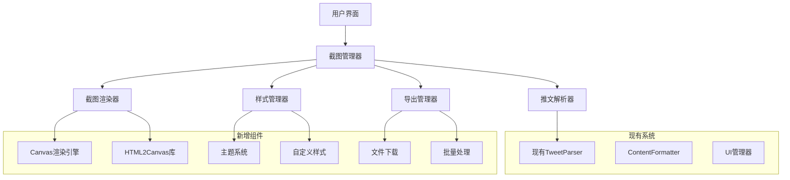

# 设计文档

## 概述

推特截图功能将作为现有Twitter增强器扩展的新模块，提供美观的推特内容截图生成能力。该功能将集成到现有的UI系统中，利用现有的解析器和格式化工具，同时添加新的截图生成和样式定制功能。

## 架构

### 整体架构图



### 技术栈选择

- **截图生成**: html2canvas + 自定义Canvas渲染
- **样式系统**: CSS-in-JS + 预设主题
- **文件处理**: Blob API + FileSaver.js
- **UI集成**: 现有的UI管理器系统
- **数据处理**: 现有的TweetParser和ContentFormatter

## 组件和接口

### 1. 截图管理器 (ScreenshotManager)

```javascript
class ScreenshotManager {
  constructor(options = {}) {
    this.renderer = new ScreenshotRenderer();
    this.styleManager = new StyleManager();
    this.exportManager = new ExportManager();
    this.settings = this.loadSettings();
  }

  // 主要接口
  async captureScreenshot(tweetElement, options = {})
  async captureBatch(tweetElements, options = {})
  async captureThread(threadElements, options = {})
  
  // 设置管理
  updateSettings(newSettings)
  getSettings()
  resetSettings()
}
```

### 2. 截图渲染器 (ScreenshotRenderer)

```javascript
class ScreenshotRenderer {
  constructor() {
    this.canvas = null;
    this.context = null;
    this.templateCache = new Map();
  }

  // 核心渲染方法
  async renderTweet(tweetData, styleConfig)
  async renderThread(threadData, styleConfig)
  async renderToCanvas(htmlContent, dimensions)
  
  // 辅助方法
  createTweetTemplate(tweetData, styleConfig)
  optimizeForScreenshot(element)
  handleMediaContent(mediaData)
}
```

### 3. 样式管理器 (StyleManager)

```javascript
class StyleManager {
  constructor() {
    this.themes = this.loadThemes();
    this.customStyles = new Map();
  }

  // 主题管理
  getTheme(themeName)
  createCustomTheme(themeConfig)
  applyTheme(element, themeName)
  
  // 样式生成
  generateCSS(styleConfig)
  optimizeForScreenshot(styles)
  handleResponsiveDesign(dimensions)
}
```

### 4. 导出管理器 (ExportManager)

```javascript
class ExportManager {
  constructor() {
    this.supportedFormats = ['png', 'jpg', 'webp'];
    this.qualitySettings = new Map();
  }

  // 导出方法
  async exportAsImage(canvas, format, quality)
  async exportBatch(canvases, format, options)
  async createZipArchive(files)
  
  // 文件处理
  generateFilename(tweetData, format)
  optimizeFileSize(imageData, targetSize)
  validateExportSettings(settings)
}
```

## 数据模型

### 截图配置模型

```javascript
const ScreenshotConfig = {
  // 尺寸设置
  dimensions: {
    width: 600,
    height: 'auto',
    aspectRatio: null, // '1:1', '16:9', '9:16'
    scale: 2 // 高清倍数
  },
  
  // 样式设置
  style: {
    theme: 'light', // 'light', 'dark', 'high-contrast', 'custom'
    backgroundColor: '#ffffff',
    textColor: '#000000',
    accentColor: '#1da1f2',
    fontFamily: 'system-ui',
    fontSize: 16,
    lineHeight: 1.5,
    borderRadius: 12,
    padding: 20,
    shadow: true
  },
  
  // 内容设置
  content: {
    includeAuthor: true,
    includeTimestamp: true,
    includeMedia: true,
    includeMetrics: false,
    includeUrl: false,
    showBranding: true,
    watermark: null
  },
  
  // 导出设置
  export: {
    format: 'png', // 'png', 'jpg', 'webp'
    quality: 0.9,
    filename: 'auto', // 'auto', 'custom'
    filenameTemplate: '{author}_{date}_{id}'
  }
};
```

### 主题配置模型

```javascript
const ThemeConfig = {
  name: 'light',
  displayName: '浅色主题',
  colors: {
    background: '#ffffff',
    surface: '#f8f9fa',
    primary: '#1da1f2',
    secondary: '#657786',
    text: '#14171a',
    textSecondary: '#657786',
    border: '#e1e8ed',
    accent: '#1da1f2'
  },
  typography: {
    fontFamily: '-apple-system, BlinkMacSystemFont, "Segoe UI", Roboto, sans-serif',
    fontSize: {
      small: 14,
      medium: 16,
      large: 18,
      xlarge: 20
    },
    fontWeight: {
      normal: 400,
      medium: 500,
      bold: 700
    },
    lineHeight: 1.5
  },
  spacing: {
    xs: 4,
    sm: 8,
    md: 16,
    lg: 24,
    xl: 32
  },
  borderRadius: {
    small: 4,
    medium: 8,
    large: 12,
    xlarge: 16
  },
  shadows: {
    small: '0 1px 3px rgba(0, 0, 0, 0.1)',
    medium: '0 4px 12px rgba(0, 0, 0, 0.15)',
    large: '0 8px 24px rgba(0, 0, 0, 0.2)'
  }
};
```

## 错误处理

### 错误类型定义

```javascript
const ScreenshotErrors = {
  RENDER_FAILED: 'RENDER_FAILED',
  CANVAS_NOT_SUPPORTED: 'CANVAS_NOT_SUPPORTED',
  EXPORT_FAILED: 'EXPORT_FAILED',
  INVALID_DIMENSIONS: 'INVALID_DIMENSIONS',
  MEDIA_LOAD_FAILED: 'MEDIA_LOAD_FAILED',
  THEME_NOT_FOUND: 'THEME_NOT_FOUND',
  BATCH_PROCESSING_FAILED: 'BATCH_PROCESSING_FAILED'
};
```

### 错误处理策略

1. **渲染失败**: 降级到简化版本，移除复杂元素
2. **媒体加载失败**: 显示占位符或跳过媒体内容
3. **导出失败**: 尝试不同格式或降低质量
4. **批量处理失败**: 跳过失败项目，继续处理其他项目
5. **主题加载失败**: 回退到默认主题

### 错误恢复机制

```javascript
class ErrorRecovery {
  static async handleRenderError(error, tweetData, config) {
    switch (error.type) {
      case ScreenshotErrors.RENDER_FAILED:
        return await this.fallbackRender(tweetData, config);
      case ScreenshotErrors.MEDIA_LOAD_FAILED:
        return await this.renderWithoutMedia(tweetData, config);
      default:
        throw error;
    }
  }
  
  static async fallbackRender(tweetData, config) {
    // 简化配置，移除可能导致问题的元素
    const fallbackConfig = {
      ...config,
      style: { ...config.style, shadow: false },
      content: { ...config.content, includeMedia: false }
    };
    return await this.basicRender(tweetData, fallbackConfig);
  }
}
```

## 测试策略

### 单元测试

1. **截图管理器测试**
   - 配置管理功能
   - 错误处理机制
   - 设置持久化

2. **渲染器测试**
   - Canvas渲染准确性
   - 不同主题渲染
   - 媒体内容处理

3. **样式管理器测试**
   - 主题切换功能
   - 自定义样式应用
   - 响应式设计

4. **导出管理器测试**
   - 不同格式导出
   - 文件命名规则
   - 批量处理功能

### 集成测试

1. **端到端截图流程**
   - 从推文选择到文件下载
   - 不同推文类型处理
   - 线程截图功能

2. **性能测试**
   - 大量推文批量处理
   - 高分辨率截图生成
   - 内存使用优化

3. **兼容性测试**
   - 不同浏览器支持
   - 移动设备适配
   - 各种推文格式

### 用户体验测试

1. **可用性测试**
   - 界面直观性
   - 操作流程顺畅性
   - 错误提示清晰性

2. **性能体验测试**
   - 截图生成速度
   - 界面响应性
   - 批量处理进度反馈

## 性能优化

### 渲染优化

1. **Canvas优化**
   - 使用OffscreenCanvas进行后台渲染
   - 实现渲染结果缓存
   - 优化图片加载和处理

2. **内存管理**
   - 及时释放Canvas资源
   - 限制并发渲染数量
   - 实现LRU缓存策略

3. **批量处理优化**
   - 使用Web Workers进行并行处理
   - 实现队列管理系统
   - 提供进度反馈机制

### 用户体验优化

1. **渐进式加载**
   - 预览模式快速生成
   - 高质量版本后台生成
   - 智能缓存策略

2. **响应式设计**
   - 自适应不同屏幕尺寸
   - 触摸设备优化
   - 键盘导航支持

## 安全考虑

### 数据安全

1. **隐私保护**
   - 不上传用户数据到外部服务器
   - 本地处理所有截图操作
   - 可选的水印和品牌标识

2. **内容安全**
   - 验证推文内容合法性
   - 过滤敏感信息
   - 支持内容模糊处理

### 技术安全

1. **代码安全**
   - 输入验证和清理
   - XSS防护措施
   - CSP策略兼容

2. **资源安全**
   - 限制文件大小和数量
   - 防止内存泄漏
   - 安全的文件下载机制

## 国际化支持

### 多语言支持

1. **界面文本**
   - 支持中文、英文、日文等主要语言
   - 动态语言切换
   - 本地化日期和数字格式

2. **字体支持**
   - 多语言字体回退机制
   - 自动字体检测和加载
   - 字体渲染优化

### 文化适配

1. **设计适配**
   - 不同文化的颜色偏好
   - 阅读习惯适配
   - 本地化设计元素

2. **功能适配**
   - 不同地区的社交媒体习惯
   - 本地化分享功能
   - 符合当地法规要求